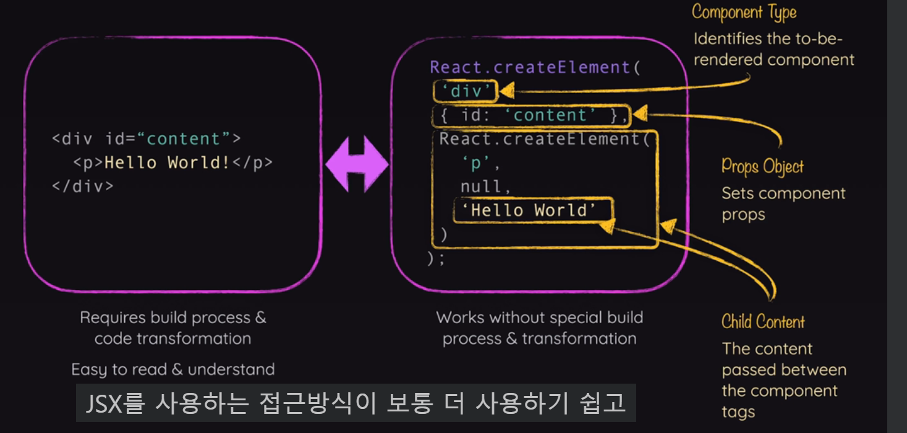

# 리액트 핵심 - 심화 단계

## JSX를 꼭 사용하지 않아도 되는 이유

- 가능은 함. 근데 굳이 그럴 필요는 없음. JSX 사용하지 않으면 빌드 과정이 필요 없음.



```jsx
const entryPoint = document.getElementById("root");
ReactDOM.createRoot(entryPoint).render(<App />);
// 위 코드를 import React from 'react'한 다음
ReactDOM.createRoot(entryPoint).render(REACT.createElement(App)); //로 수정 가능
```

## Fragments 사용법

- return 할 때 상위 요소를 이용하여 하나로 묶어야함.
- div로 묶는 대신 import { Fragment } from 'react' 를 하고 \<Fragment> \</Fragment>안에 넣어주는 방법이 있음.
- \<> \</> 이걸로도 됨. 최신 리액트 버전

## 컴포넌트 분리하기

- 컴포넌트 분리 잘 안하면 불필요한 컴포넌트 함수들이 재사용되거나 하는 경우 많음.
- 기능에 따라 분리하면 좋음.

```jsx
<Header />
<main>
	<CoreConcepts />
	<Examples />
</main>
// 예전에는 App에 다 몰아주어서 App이 다시 실행되었는데 이제 각각 컴포넌트 함수를 다른 파일에 주어서 서로 영향 X
```

## 내부 요소에 Props(속성)이 전달되지 않는 경우

- 이런 식으로 넣을 수 있음.
- 다른 방법도 있음.

```jsx
//Examples.jsx
<Section title="Examples" id="examples"></Section>;

//Section.jsx
export default function Section({ title, id, children }) {
  return (
    <section id={id}>
      <h2>{title}</h2>
      {children}
    </section>
  );
}
```

## 감싸진 요소에 속성 전달하기.

```jsx
//Examples.jsx
<Section title="Examples" id="examples"></Section>;

//Section.jsx
export default function Section({ title, children, ...props }) {
  return (
    <section {...props}>
      <h2>{title}</h2>
      {children}
    </section>
  );
}
```

- title, children이 아닌 {id="examples"} 이 그대로 props로 묶임. section {...props} 부분에서 풀어짐.

```jsx
<TabButton
          isSelected={selectedTopic === "state"}
          onSelect={() => handleSelect("state")}
        >
		</TabButton>

export default function TabButton({ children, onSelect, isSelected }) {
  console.log('TABBUTTON COMPONENT EXECUTING');
  return (
    <li>
      <button className={isSelected ? 'active' : undefined} onClick={onSelect}>
        {children}
      </button>
    </li>
  );
// 위는 기존인데
<TabButton
          isSelected={selectedTopic === "state"}
          onClick={() => handleSelect("state")}
        >
          State
        </TabButton>

export default function TabButton({ children, isSelected, ...props }) {
  console.log("TABBUTTON COMPONENT EXECUTING");
  return (
    <li>
      <button className={isSelected ? "active" : undefined} {...props}>
        {children}
      </button>
    </li>
  );
}
// 이런식으로 바꿀 수 있음.
```

## 여러 JSX 슬롯 활용법

- 아래 같은 방식으로 적용 가능하다. buttons 따로 아래 컨텐트 따로

```jsx
//Examples.jsx
<Tabs
  buttons={
    <>
      <TabButton
        isSelected={selectedTopic === "components"}
        onClick={() => handleSelect("components")}
      >
        Components
      </TabButton>
      <TabButton
        isSelected={selectedTopic === "jsx"}
        onClick={() => handleSelect("jsx")}
      >
        JSX
      </TabButton>
      <TabButton
        isSelected={selectedTopic === "props"}
        onClick={() => handleSelect("props")}
      >
        Props
      </TabButton>
      <TabButton
        isSelected={selectedTopic === "state"}
        onClick={() => handleSelect("state")}
      >
        State
      </TabButton>
    </>
  }
>
  {tabContent}
</Tabs>;

// Tabs.jsx
export default function Tabs({ children, buttons }) {
  return (
    <>
      <menu>{buttons}</menu>
      {children}
    </>
  );
}
```

## 컴포넌트 타입 동적으로 설정하기.

- 컴포넌트 요소 동적으로 설정하기 가능

```jsx
// 아래 같이 하면됨. custom container 보내려면 {} 동적으로 buttonsContainer={Section} 이런 느낌. 근데
<Tabs buttonsContainer="menu"></Tabs>;

export default function Tabs({ children, buttons, buttonsContainer }) {
  const ButtonsContainer = buttonsContainer;
  return (
    <>
      <ButtonsContainer>{buttons}</ButtonsContainer>
      {children}
    </>
  );
}
// 소문자로 하면 내장요소라고 생각하기 때문에  const ButtonsContainer = buttonsContainer; 따로 받아줌. 아니면 처음부터 넘길때  <Tabs ButtonsContainer="menu"></Tabs>; 대문자로 넘겨도 됨.

// 더 쉬운 방법
<Tabs></Tabs>;
export default function Tabs({ children, buttons, ButtonsContainer = "menu" }) {
  return (
    <>
      <ButtonsContainer>{buttons}</ButtonsContainer>
      {children}
    </>
  );
}

```

## Tic Tac Toe 게임 만들기

- index.html은 결국 우리의 웹사이트를 방문할 사람들이 볼 내용임.
- 리액트 작업할 때 필요하다면 여기에 마크업을 더할수 있음. 정적인 마크업 즉, 다른 데이터에 영향을 받지 않고 받을 필요가 없는 요소는 그냥 index.html에 넣어도 됨.
- public 폴더에 있는 이미지는 공개되는 이미지들, 그래서 그냥 \ 이렇게 써줘도 됨. 컴포넌트에서도 이렇게 써줘도 됨.

```txt
public/ 폴더
이전 강의에서 보았듯이, 이미지를 public/ 폴더에 저장하고 index.html 또는 index.css 파일 내에서 직접 참조할 수 있습니다. 이렇게 하는 이유는 public/에 저장된 이미지 (또는 일반적으로: 파일)이 프로젝트 개발 서버 및 빌드 프로세스에 의해 공개적으로 제공되기 때문입니다. index.html과 마찬가지로, 이 파일들은 브라우저 내에서 직접 방문할 수 있으며, 따라서 다른 파일에 의해 요청될 수도 있습니다. 예를 들어, localhost:5173/some-image.jpg를 불러오면 해당 이미지를 볼 수 있습니다 (물론 public/ 폴더에 이미지가 있을 경우).

src/assets/ 폴더
이미지를 src/assets/ 폴더 (또는 실제로는 src폴더의 어디든)에 저장할 수도 있습니다. 그렇다면 public/와 비교해 어떤 차이가 있을까요? src 또는 src/assets/와 같은 하위 폴더에 저장된 모든 파일(어떤 형식이든)은 공개적으로 제공되지 않습니다. 웹사이트 방문자가 접근할 수 없습니다. localhost:5173/src/assets/some-image.jpg 를 불러오려고 하면 오류가 발생합니다.

대신,src/ (및 하위 폴더)에 저장된 파일은 코드 파일에서 사용할 수 있습니다. 코드 파일에 가져온 이미지는 빌드 프로세스에 의해 인식되어 최적화되며, 웹사이트에 제공하기 직전에 public/ 폴더에 "삽입"됩니다. 가져온 이미지는 참조한 위치에서 자동으로 링크가 생성되어 사용됩니다.

어떤 폴더를 사용해야 할까요?
빌드 프로세스에 의해 처리되지 않는 이미지는public/폴더를 사용해야 하고 대체적으로 사용 가능 가능합니다. 예를 들면 index.html 파일이나 파비콘과 같은 이미지가 좋은 후보입니다. 반면, 컴포넌트 내에서 사용되는 이미지는 일반적으로src/폴더(예: src/assets/)에 저장되어야 합니다.
```

- 밑에처럼 하는거 권장되지 않음. 상태 변경 시 이전의 상태 값에 기반하여 변경한다면 화살표함수로 써야함!!

```jsx
const [isEditing, setIsEditing] = useState(false);

function handleEditClick() {
  setIsEditing(!isEditing);
  setIsEditing(!isEditing);
}
// 상태변경이 즉각적인게 아니라 리액트가 미래에 수정하고자 상태변경 스케줄을 조율함. 그래서 isEditing이 True 였다면 위에 setIsEditing에 들어가는 isEditing도 True 아래도 True임.

function handleEditClick() {
  setIsEditing((editing) => !editing);
}
// 이렇게 써야함.
```

- 양방향 바인딩

```jsx
import { useState } from "react";

export default function Player({ initialName, symbol }) {
  const [isEditing, setIsEditing] = useState(false);
  const [playerName, setPlayerName] = useState(initialName);

  function handleEditClick() {
    setIsEditing((editing) => !editing);
  }

  function handleChange(event) {
    setPlayerName(event.target.value);
  }

  let editablePlayerName = <span className="player-name">{playerName}</span>;

  if (isEditing) {
    editablePlayerName = (
      <input type="text" required value={playerName} onChange={handleChange} />
    );
  }

  return (
    <li>
      <span className="player">
        {editablePlayerName}
        <span className="player-symbol">{symbol}</span>
      </span>
      <button onClick={handleEditClick}>{isEditing ? "Save" : "Edit"}</button>
    </li>
  );
}
```

- React에서는 상태(state)를 직접 수정하는 것을 피하고, 대신 상태를 복사한 후 새로운 상태를 반환하여 업데이트하는 방식을 권장함.

```jsx
setGameBoard((prevGameBoard) => {
  const updatedBoard = [...prevGameBoard.map((innerArray) => [...innerArray])];
  updatedBoard[rowIndex][colIndex] = "X";
  return updatedBoard;
});

// 위와 같은 방식으로 prevGameBoard를 직접 수정하지 않음. 예기치 않는 버그 유발 방지
```

- 상태 끌어올리기 (위에서 제어) -> 여기선 App.jsx에서 제어해서 전적으로 뿌림.
- 상태를 하나 더 만들어서 크게 다를 것 없는 정보를 저장하는것은 개발자로서 피하는 것이 좋음.

```jsx
//App.jsx
function handleSelectSquare(rowIndex, colIndex) {
    setActivePlayer((curActivePlayer) => (curActivePlayer === "X" ? "O" : "X"));
    setGameTurns((prevTurns) => {
      let currentPlayer = "X";
      if (prevTurns.length > 0 && prevTurns[0].player === "X") {
        currentPlayer = "O";
      }
      const updatedTurns = [
        { square: { row: rowIndex, col: colIndex }, player: currentPlayer },
        ...prevTurns,
      ];
      return updatedTurns;
    });
  }

  <GameBoard onSelectSquare={handleSelectSquare} turns={gameTurns} />
  //이런식으로 handleSelectSquare인자 받을 수 있는거 확인

// GameBoard.jsx
<button onClick={() => onSelectSquare(rowIndex, colIndex)}>
                  {playerSymbol}
                </button>
```

- 아래와 같이 백틱에 ${}를 해서 문자열에 변수 넣을 수 있음. 위에 방법 그냥 거의 외우다싶이 하셈.

```jsx
export default function Log({ turns }) {
  return (
    <ol id="log">
      {turns.map((turn) => (
        <li key={`${turn.square.row}${turn.square.col}`}>
          {turn.player} selected {turn.square.row},{turn.square.col}
        </li>
      ))}
    </ol>
  );
}
```

- buttons에 disabled 줘서 버튼 안눌리게 한거 확인
- 가끔은 끌어올려서는 안되는 데이터가 있음. 계속 업데이트 될까봐

```jsx
function handlePlayerNameChange(symbol, newName) {
  setPlayers((prevPlayers) => {
    return {
      ...prevPlayers,
      [symbol]: newName,
    };
  });
}
// 이런 식으로 동적으로 prevPlayers 갱신 가능 바뀌는 부분은 symbol로 업데이트
```
